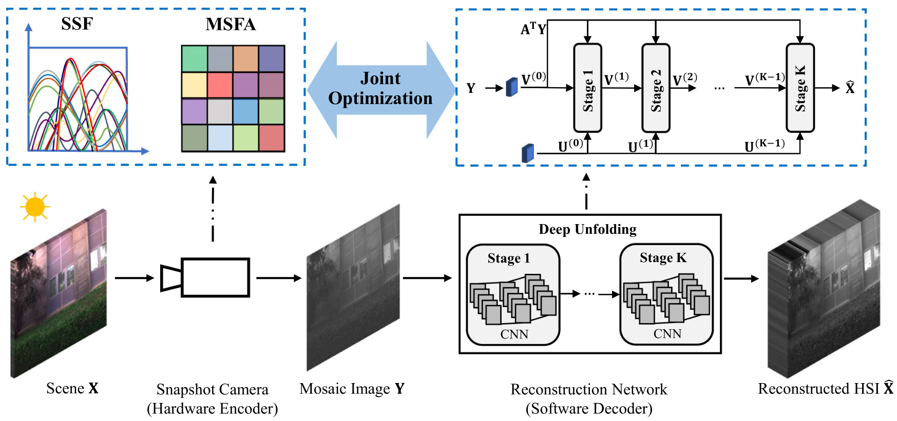

# Hyperspectral_Imaging
Code for [this paper](https://ieeexplore.ieee.org/abstract/document/9787797).

**Joint Spatial-Spectral Pattern Optimization and Image Reconstruction for Hyperspectral Imaging (IEEE-JSTSP 2022)**

[Tao Zhang](https://github.com/ColinTaoZhang), [Zhiyuan Liang](http://zhiyuan0112.github.io/) and [Ying Fu](https://ying-fu.github.io/).

## Introduction
In this paper, we propose a deep-learning based method for high quality hyperspectral imaging by joint spatial-spectral optimization, including joint multispectral filter array (MSFA) and spectral sensitivity function (SSF) optimization, joint spatial demosaicing (SpaDM) and spectral super-resolution (SpeSR), and joint pattern optimization and HSI reconstruction. 



## Prerequisites
* Python >= 3.6, PyTorch >= 1.7.1

## Getting Strated

### 1. Install the enviromemts
```bash
conda install -c conda-forge python-lmdb
conda install caffe
pip install --upgrade git+https://github.com/pytorch/tnt.git@master

pip install -r requirements.txt
```

### 2. Prepare datasets
- [ICVL](http://icvl.cs.bgu.ac.il/hyperspectral/)
- [Harvard](http://vision.seas.harvard.edu/hyperspec/explore.html)

To generate the taining and testing data, run
```python utility/lmdb_data.py```

### 3. Trian
#### Spatial Optimization
```bash
python hsi_dm.py -a admmn_16channel_alpha -d /Path/to/Your/Data
```

#### Spatial-Spectral Optimization
- Selection
  ```bash
  python hsi_dm.py -a admmn_alpha -d /Path/to/Your/Data
  ```

- Design
  ```bash
  python hsi_dm.py -a admmn_spectrum -d /Path/to/Your/Data
  ```
 
### 4. Test
```bash
python hsi_test.py -a admmn_16channel_alpha --use-2dconv -r -rp /Path/to/Your/Model
```
 
## Citation
If you find this work useful for your research, please cite:
```bibtex
@ARTICLE{zhang2022joint,
  author={Zhang, Tao and Liang, Zhiyuan and Fu, Ying},
  journal={IEEE Journal of Selected Topics in Signal Processing}, 
  title={Joint Spatial-Spectral Pattern Optimization and Hyperspectral Image Reconstruction}, 
  year={2022},
  volume={16},
  number={4},
  pages={636-648},
}
```
